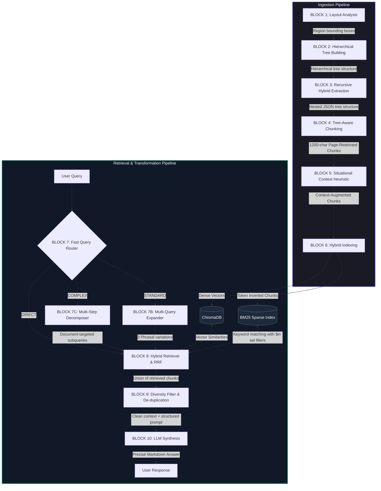
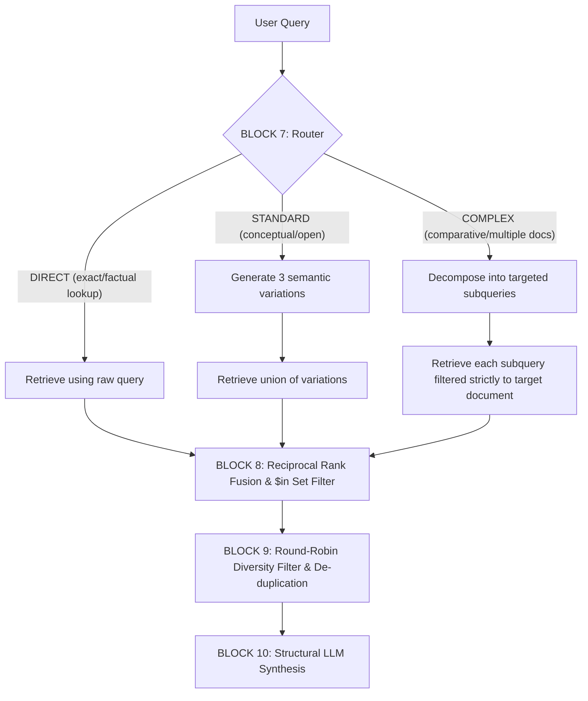

# RAG Bot System Architecture (Flow Chat v4)

This document provides a comprehensive, block-level architectural engineering guide for the **Flow Chat RAG Bot**, detailing both the **Ingestion Pipeline** and the advanced **Retrieval & Query Transformation Phase**. 

---

## Overall System Architecture

The following block diagram represents the complete end-to-end lifecycle of a document, from raw PDF ingestion to the final structured user response.



---

## 1. Document Ingestion Phase (Processing & Indexing)

The ingestion pipeline converts raw PDF files into context-aware, structured chunks indexed for rapid multi-dimensional search.

---

### **BLOCK 1: Layout Analysis**

#### **Functional Purpose & Design Rationale**
Standard text parsers (such as PDFMiner or raw PyPDF extraction) extract streams of characters linearly, completely losing spatial layout context. This causes catastrophic failure when processing multi-column documents, key-value grids, sidebars, headers, and tables. 

Block 1 replaces linear text streaming with a vision-based layout analysis engine. By treating each page as an image and executing object detection, it identifies the precise bounding coordinates of semantic elements. This guarantees that headers, columns, key-value regions, checkboxes, and tables are treated as independent physical boundaries before text extraction begins.

#### **Data Flow & Sequence**
1. **Rasterization**: PyMuPDF takes the absolute file path of the PDF and rasterizes each page into high-resolution RGB pixel streams at a defined DPI.
2. **Preprocessing**: The processor scales and normalizes the image tensor to prepare it for neural network input.
3. **Inference**: The visual RT-DETR model runs inference to predict bounding box coordinates and object class labels.
4. **Post-Processing**: Non-Maximum Suppression (NMS) removes overlapping boxes of the same class. Bounding coordinates are scaled from screen pixel space back to physical PDF points.

#### **Input Interface Specification**
* **`pdf_path`** (`str`): Absolute file system path (e.g., `"C:/uploads/demo-invoice.pdf"`).
* **`threshold`** (`float`, default: `0.5`): Confidence threshold for filtering bounding boxes.
* **`dpi`** (`int`, default: `200`): Dots-per-inch resolution used for page rasterization.

*Schema Representation:*
```python
pdf_path: str = "C:/uploads/demo-invoice.pdf"
threshold: float = 0.5
dpi: int = 200
```

#### **Output Interface Specification**
* **`regions`** (`List[Dict[str, Any]]`): List of detected spatial block dictionaries.

*Schema Representation:*
```json
[
  {
    "page": 1,
    "type": "Table",
    "bbox": [18.5, 42.0, 580.2, 310.4],
    "bbox_pixels": [51, 116, 1612, 862],
    "confidence": 0.942,
    "image": "<PIL.Image.Image object at 0x000002A3B>"
  }
]
```

#### **Core Algorithms & Code Logic**
1. **Coordinate Scaling Math**: Bounding box pixels coordinates `[x0_px, y0_px, x1_px, y1_px]` are mapped back to native PDF point dimensions `[x0_pdf, y0_pdf, x1_pdf, y1_pdf]` using:
   $$x_{pdf} = x_{px} \cdot \left(\frac{Width_{pdf}}{Width_{px}}\right)$$
   $$y_{pdf} = y_{px} \cdot \left(\frac{Height_{pdf}}{Height_{px}}\right)$$
2. **Model Safety**: Thread-safe inference is enforced via a dedicated class-level lock (`HeronLayoutAnalyzer._lock = threading.Lock()`) to prevent shared GPU tensor corruption when processing parallel requests.

#### **Technology Stack & APIs**
* **`fitz` (PyMuPDF)**: Rasterization of PDF pages to raw image bytes.
* **`PIL (Pillow)`**: Native image object operations and cropping.
* **`transformers.RTDetrV2ForObjectDetection` & `RTDetrImageProcessor`**: Visual object detection model loaded from model hub path `"ds4sd/docling-layout-heron-101"`. Runs on CUDA if a GPU is detected; otherwise, defaults to CPU.

---

### **BLOCK 2: Hierarchical Tree Building**

#### **Functional Purpose & Design Rationale**
Layout regions detected by vision models are returned as flat, un-ordered coordinate blocks. They lack structural awareness (e.g., they do not know if a text block belongs inside a two-column section or if a cell value resides inside a key-value region). 

To solve this, Block 2 constructs a geometric parent-child tree structure. Organizing regions hierarchically reconstructs the logical reading flow of the document and keeps nested data together.

#### **Data Flow & Sequence**
1. **Sorting**: Sorts all detected regions on a page by area size in descending order (largest bounding boxes first).
2. **Containment Inspection**: Iterates through sorted nodes, treating larger containers as candidate parent nodes.
3. **Child Nesting**: Evaluates smaller, remaining regions against the candidate parent box. If they lie within the parent's area, they are added to the parent's `"children"` list and removed from the global pool.
4. **Ordering**: Recursively sorts children of every node in reading order (top-to-bottom, left-to-right).

#### **Input Interface Specification**
* **`regions`** (`List[Dict[str, Any]]`): Flat list of layout regions containing bounding boxes.

*Schema Representation:*
```python
regions = [
  {"type": "Key-Value Region", "bbox": [10.0, 10.0, 200.0, 200.0], "page": 1},
  {"type": "Text", "bbox": [15.0, 20.0, 90.0, 50.0], "page": 1}
]
```

#### **Output Interface Specification**
* **`region_tree`** (`List[Dict[str, Any]]`): Geometric parent-child tree representation.

*Schema Representation:*
```json
[
  {
    "type": "Key-Value Region",
    "bbox": [10.0, 10.0, 200.0, 200.0],
    "page": 1,
    "children": [
      {
        "type": "Text",
        "bbox": [15.0, 20.0, 90.0, 50.0],
        "page": 1,
        "children": []
      }
    ]
  }
]
```

#### **Core Algorithms & Code Logic**
* **Geometric Containment Check**: A child bounding box ($B_{child}$) is established as nested inside a parent bounding box ($B_{parent}$) if they are on the same page and the intersection area divided by the child area is greater than or equal to a target threshold (default `0.6`, indicating 60% spatial overlap):
  $$Area(B_{child}) = (x_{1}^{c} - x_{0}^{c}) \cdot (y_{1}^{c} - y_{0}^{c})$$
  $$x_{overlap} = \max\left(0, \min(x_{1}^{c}, x_{1}^{p}) - \max(x_{0}^{c}, x_{0}^{p})\right)$$
  $$y_{overlap} = \max\left(0, \min(y_{1}^{c}, y_{1}^{p}) - \max(y_{0}^{c}, y_{0}^{p})\right)$$
  $$Intersection = x_{overlap} \cdot y_{overlap}$$
  $$\text{IsContained} = \left(\frac{Intersection}{Area(B_{child})} \ge 0.60\right)$$

#### **Technology Stack & APIs**
* **Custom Python Implementation**: Engineered directly in `RAGPipelineOrchestrator._resolve_region_tree` using core geometric calculations.

---

### **BLOCK 3: Recursive Hybrid Extraction**

#### **Functional Purpose & Design Rationale**
Once regions are geometrically organized, text and data must be extracted from the exact visual bounds of each node. Standard PDF stream extraction across a whole page bleeds characters across separate columns or tables.

Block 3 addresses this with a hybrid extraction method. It restricts pyMuPDF/pdfplumber text extraction to the exact coordinate limits of text regions, applies highly tailored grid/flow table extraction routines for table nodes, and uses Tesseract OCR on images/checkbox regions. This keeps layouts structured, checkboxes classified, and tables intact.

#### **Data Flow & Sequence**
1. **Grouping**: Groups the hierarchically structured region tree by page.
2. **Page Cropping**: Crops the pdfplumber page object to match the boundary of the region.
3. **Execution Routing**:
   * **Table**: Routes page crops to the Grid/Flow tabular extraction engine.
   * **Checkbox**: Extracts the cropped bounding box image and runs OCR to fetch checkbox text labels, determining the check status from the visual model tag.
   * **Standard Text/Forms**: Extracts the coordinate-restricted text stream or runs Tesseract OCR as a fallback.
4. **Recursion**: Traverses down the children array of the node, recursively extracting nested content.

#### **Input Interface Specification**
* **`pdf_path`** (`str`): Target PDF path.
* **`region_tree`** (`List[Dict[str, Any]]`): Structured region tree.

*Schema Representation:*
```python
pdf_path: str = "C:/uploads/demo-invoice.pdf"
region_tree: List[Dict[str, Any]] = [...]
```

#### **Output Interface Specification**
* **`extracted_data`** (`List[Dict[str, Any]]`): Rich recursive dictionary of page structures.

*Schema Representation:*
```json
[
  {
    "type": "table",
    "page": 1,
    "bbox": [18.5, 42.0, 580.2, 310.4],
    "metadata": {"confidence": 0.942, "method": "grid"},
    "data": [
      {
        "row_id": 1,
        "columns": {
          "description": "Premium Widget",
          "quantity": "2",
          "unit_price": "$100.00",
          "total": "$200.00"
        }
      }
    ],
    "nested_content": []
  }
]
```

#### **Core Algorithms & Code Logic**
1. **Grid vs. Flow Table Logic**:
   * *Grid Engine*: Attempts to extract tables with visible borders using `pdfplumber` line intersections.
   * *Flow Engine*: If no borders are detected, falls back to a custom coordinate word clustering algorithm:
     * Sorts all words inside the bounding box by vertical coordinate `top`.
     * Clusters words into rows using a vertical tolerance ($y_{tolerance} = 6$ points).
     * Sorts words in each row by $x_0$ coordinate.
     * Selects the best candidate header row using role-vocab token overlap scoring (awards terms like `"item"`, `"description"`, `"price"`, `"qty"`; penalizes dates or numeric patterns).
     * Calculates column interval coordinates `[x0, x1]` for each header cell.
     * Maps subsequent words into columns based on their horizontal center $cx$.
2. **Normalisation Heuristic**: Table headers are normalized into lowercase snake-case formatting (e.g. `Invoice Date` -> `invoice_date`) using:
   `re.sub(r"[\s\-/]+", "_", header_str.strip().lower())`

#### **Technology Stack & APIs**
* **`pdfplumber`**: For character coordinate tracking, bounding box cropping, and grid table extraction.
* **`pytesseract`**: Restricted-bbox OCR engine using Page Segmentation Mode `--psm 6` (assumes a single uniform block of text).
* **Custom Python Flow Engine**: Class `HybridOCRExtractor` inside `src/blocks/extractor/hybrid_ocr_extractor.py`.

---

### **BLOCK 4: Tree-Aware Chunking**

#### **Functional Purpose & Design Rationale**
Standard RAG pipelines chunk text blindly at fixed token sizes (e.g., split every 500 tokens). This breaks tabular structures and separates critical headers from their values (e.g., an invoice number is placed in Chunk 1 while the actual number is placed in Chunk 2).

Block 4 solves this by parsing hierarchical nodes and merging them using page-restricted limits. Table nodes are isolated completely and converted into unbroken Markdown tables, while text elements are grouped in reading order on the same page up to a strict `1200` character limit, keeping related information together.

#### **Data Flow & Sequence**
1. **Flattening**: Traverses the hierarchical extraction tree recursively, generating flat nodes.
2. **Context Prepend**: Builds a structural breadcrumb string (e.g. `[Inside Table]`, `[Inside Key-Value Region]`) and prepends it to the node content.
3. **Buffering & Merging**:
   * Consecutive plain text chunks on the *same page* are merged into a buffer.
   * If adding the next block exceeds `1200` characters, or if a page change occurs, the buffer is flushed as a final chunk.
   * If a table node is encountered, the text buffer is flushed immediately. The table is then converted to Markdown and output as a standalone chunk.

#### **Input Interface Specification**
* **`extracted`** (`Dict[str, Any]`): Hierarchical JSON of parsed document pages.
* **`merge_plain_max_len`** (`int`, default: `1200`): Character merging threshold.

*Schema Representation:*
```python
extracted: Dict[str, Any] = {"document": {"metadata": {"source": "demo.pdf"}, "pages": [...]}}
```

#### **Output Interface Specification**
* **`chunks`** (`List[Dict[str, Any]]`): List of individual chunk dictionaries with assigned UUIDs.

*Schema Representation:*
```json
[
  {
    "id": "e2a4b862-ffb7-4c7b-9e42-7a716c68a41b",
    "text": "[Document: demo-invoice.pdf] [Inside Key Value Region]\n\nbilling_address: 123 Main St\ninvoice_date: 2026-05-23",
    "metadata": {
      "page": 1,
      "source": "demo-invoice.pdf",
      "type": "text_block"
    },
    "type": "text_block"
  }
]
```

#### **Core Algorithms & Code Logic**
1. **Page-Restricted Accumulator**:
   ```python
   # Simple trace of the buffer logic:
   total_len = sum(len(c["text"]) for c in buffer)
   if total_len >= max_len or current_page != buffer_page:
       flush_buffer()
   ```
2. **Large Table Sliding Window**: Large tables (over 7 rows) are split into overlapping window chunks to fit vector model sizes without losing row context. It uses a sliding window of 5 rows with a stride of 3 rows:
   ```python
   # For row indices: 0..N
   window = rows[i:i+5] # dynamic markdown matrix generation
   ```

#### **Technology Stack & APIs**
* **Custom Python Chunker**: `chunker.py` and `table_utils.py`.

---

### **BLOCK 5: Situational Context Heuristic & LLM Contextualizer**

#### **Functional Purpose & Design Rationale**
Search index retrievers struggle if a text chunk contains generic terms (e.g., "Balance due: $500" without indicating the vendor or customer). 

Block 5 solves this by prepending a situational context header to every chunk. It uses a fast local LLM (or a fast manual metadata heuristic) to generate a concise, one-sentence description of the chunk in relation to the overall document. This guarantees that every chunk contains the identity of the document (vendor, customer, document type) to prevent retrieval failure.

#### **Data Flow & Sequence**
1. **Context Windowing**: For each chunk, reads the target chunk text and gathers surrounding chunks for additional context.
2. **Type-Specific Prompt Selection**: Configures instructions based on document type (e.g. `invoice` prompts prioritize vendors/customers; `bank_statement` prompts prioritize transactions/balances).
3. **LLM Inference**: Calls a local LLM via Ollama at temperature `0.0` to generate a one-sentence summary starting with `"This chunk contains..."`.
4. **Fallback Execution**: If the LLM call fails or times out, prepends a deterministic manual metadata header: `[Document: filename.pdf] [Page X]`.

#### **Input Interface Specification**
* **`chunks`** (`List[Dict[str, Any]]`): List of plain text chunks.
* **`doc_name`** (`str`): Target document name (e.g. `"demo-invoice.pdf"`).
* **`doc_type`** (`str`): Document class (e.g. `"invoice"`).

*Schema Representation:*
```python
chunks = [{"text": "Total amount: $500.00", "metadata": {"page": 1}}]
doc_name = "demo-invoice.pdf"
doc_type = "invoice"
```

#### **Output Interface Specification**
* **`contextualized_chunks`** (`List[Dict[str, Any]]`): Chunks with prepended context headers.

*Schema Representation:*
```json
[
  {
    "text": "This chunk contains the total amount due for demo-invoice.pdf.\n\nTotal amount: $500.00",
    "original_text": "Total amount: $500.00",
    "metadata": {
      "page": 1,
      "contextualized": true
    }
  }
]
```

#### **Core Algorithms & Code Logic**
* **Prompt Anchor Injection**: The LLM prompt combines a `Global_Truth_Header` (defining the document identity) and a `Local_Nearby_Context` window. Zero-temperature inference ensures deterministic, predictable outputs:
  ```python
  payload = {
      "model": "llama3.2:3b",
      "prompt": prompt,
      "options": {"temperature": 0.0}
  }
  ```

#### **Technology Stack & APIs**
* **Ollama native endpoint**: Running local `/api/generate` calls on `http://localhost:11434`.
* **`httpx` (AsyncClient)**: Handles parallel API connections with safety timeouts.
* **`LocalContextualizer`**: Python orchestration class in `src/preprocessing/contextualizer.py`.

---

### **BLOCK 6: Hybrid Indexing**

#### **Functional Purpose & Design Rationale**
A robust search pipeline requires both semantic (meaning-based) and keyword (exact value/identifier) retrieval. 

Block 6 indices every context-augmented chunk into two separate storage structures: a dense vector space (for semantic proximity) and a sparse inverted index (for exact token matchings, crucial for invoice numbers and dates).

#### **Data Flow & Sequence**
1. **Tokenization**: Tokenizes chunk text using regex to preserve dates and alphanumeric symbols.
2. **Sparse Ingestion**: Feeds tokenized chunks into the BM25 Okapi model.
3. **Embedding Encoding**: Encodes text into 384-dimensional dense vectors.
4. **Storage Ingestion**:
   * **Dense**: Writes embeddings, texts, and metadata to ChromaDB collections.
   * **Sparse**: Pickles the BM25 index and writes it to disk.

#### **Input Interface Specification**
* **`chunks`** (`List[Dict[str, Any]]`): List of context-augmented chunks.

*Schema Representation:*
```python
chunks = [{"text": "This chunk contains invoice details...", "metadata": {"page": 1, "doc_id": "uuid-123"}}]
```

#### **Output Interface Specification**
* Writes **dense vector collections** to the local ChromaDB database.
* Writes a **serialized sparse index file** (`bm25.pkl`) to disk.

#### **Core Algorithms & Code Logic**
1. **Robust Sparse Tokenizer**: Normalizes text and extracts tokens, preserving dates and punctuation boundaries (like slashes and hyphens) so terms like `09/09/2023` are matched exactly:
   ```python
   def tokenize(text: str) -> List[str]:
       return re.findall(r'[a-z0-9/-]+', text.lower())
   ```
2. **Dense Vector Embedding**: Encodes chunk text into a normalized hypersphere space:
   $$\vec{v} = Embed(Chunk)$$

#### **Technology Stack & APIs**
* **`sentence-transformers/all-MiniLM-L6-v2`**: 384-dimensional dense embedding model.
* **`ChromaDB`**: Persistent local vector database.
* **`rank_bm25` (BM25Okapi)**: Exact inverted index keyword algorithm.

---

## 2. Retrieval & Query Transformation Phase

The query and retrieval loop uses advanced query transformations to maximize precision and eliminate hallucinations in transactional and comparative questions.



---

### **BLOCK 7: Fast Query Router**

#### **Functional Purpose & Design Rationale**
Advanced query transformations (like expansion and decomposition) increase search accuracy but introduce significant LLM latency. Simple questions (e.g. "What is the invoice number?") do not need these steps.

Block 7 uses a fast classification router to categorize incoming queries. Simple factual questions skip transformation entirely and route to direct retrieval, while complex queries are sent to the appropriate transformation pipeline, optimizing search speed and accuracy.

#### **Data Flow & Sequence**
1. **Request Received**: The router receives the raw user query.
2. **System Prompt Preparation**: Builds a routing prompt with few-shot examples for classification.
3. **LLM Evaluation**: Calls the LLM at temperature `0.0` for a fast classification decision.
4. **Execution Routing**: Routes the query to standard DIRECT retrieval, STANDARD expansion, or COMPLEX decomposition.

#### **Input Interface Specification**
* **`query`** (`str`): Raw user question.
* **`llm_provider`** (`str`, default: `"ollama"`): LLM target (`"groq"` or `"ollama"`).

*Schema Representation:*
```python
query: str = "Compare invoice Steve.pdf and John.pdf"
llm_provider: str = "groq"
```

#### **Output Interface Specification**
* **`route`** (`str`): Route classification string (`"DIRECT"`, `"STANDARD"`, or `"COMPLEX"`).

*Schema Representation:*
```python
route: str = "COMPLEX"
```

#### **Core Algorithms & Code Logic**
* **Deterministic Classification**: Uses a strict, zero-temperature few-shot classification prompt. If the model call fails, it defaults to `"DIRECT"` to guarantee search continuity:
  ```python
  if "COMPLEX" in result.upper(): return "COMPLEX"
  elif "STANDARD" in result.upper(): return "STANDARD"
  else: return "DIRECT"
  ```

#### **Technology Stack & APIs**
* **Groq Cloud API**: Uses `llama-3.3-70b-versatile` for sub-100ms routing.
* **Ollama local engine**: Falls back to local `llama3.2:3b` in offline environments.

---

### **BLOCK 7B: Multi-Query Expander**

#### **Functional Purpose & Design Rationale**
User queries often use different terms than the stored documents (e.g., a search for "remittance" won't match a document that only says "wire transfer"). 

Block 7B addresses this vocabulary mismatch by generating 3 semantic variations of the user query. This improves recall, ensuring the search engine finds the relevant chunks regardless of the specific terms used.

#### **Data Flow & Sequence**
1. **Prompt Compilation**: Formats the query with instructions to generate diverse synonyms and phrasal structures.
2. **JSON Generation**: The LLM outputs a structured JSON array containing 3 variations.
3. **Fallback Extraction**: If the LLM returns plain text or a numbered list instead of valid JSON, a regex parser extracts the queries.
4. **Aggregation**: Prepends the original query to the generated variations, returning a list of 4 distinct search queries.

#### **Input Interface Specification**
* **`query`** (`str`): Raw user query.

*Schema Representation:*
```python
query: str = "What are the payment terms?"
```

#### **Output Interface Specification**
* **`variations`** (`List[str]`): List containing the original query and up to 3 phrasal variations.

*Schema Representation:*
```json
[
  "What are the payment terms?",
  "invoice payment conditions and schedule",
  "due date rules and transaction requirements"
]
```

#### **Core Algorithms & Code Logic**
* **Robust JSON Extraction Fallback**:
  ```python
  # Extracts JSON arrays wrapped in LLM markdown blocks:
  match = re.search(r'(\[[\s\S]*\])', result)
  if match:
      variations = json.loads(match.group(1))
  ```

#### **Technology Stack & APIs**
* **Groq Cloud** / **Ollama** (`QueryRewriter.expand_query`).

---

### **BLOCK 7C: Multi-Step Decomposer**

#### **Functional Purpose & Design Rationale**
Complex queries that compare multiple entities (e.g. "Compare the tax paid in invoice_Steve.pdf and invoice_John.pdf") fail under single-shot vector retrieval because the system cannot search for both documents effectively at once.

Block 7C solves this by breaking down complex queries into independent subqueries, mapping each to its specific target document.

#### **Data Flow & Sequence**
1. **Analysis**: Evaluates the user query to identify distinct sub-questions and document references.
2. **Decomposition**: The LLM splits the query into simplified, single-topic search tasks.
3. **Document Association**: Binds each subquery to a target document filename (or sets it to `null` if global).
4. **Structured Return**: Outputs a structured JSON array of subquery objects.

#### **Input Interface Specification**
* **`query`** (`str`): Complex comparative query.

*Schema Representation:*
```python
query: str = "Compare the tax of invoice_A.pdf and invoice_B.pdf"
```

#### **Output Interface Specification**
* **`subqueries`** (`List[Dict[str, Any]]`): List of structured subquery objects.

*Schema Representation:*
```json
[
  {"query": "total tax amount paid", "document": "invoice_A.pdf"},
  {"query": "total tax amount paid", "document": "invoice_B.pdf"}
]
```

#### **Core Algorithms & Code Logic**
* **Regex Fallback Parser**: If the LLM returns plain text instead of JSON, the system uses a fallback regex pattern to identify document names and construct structured subquery mappings:
  ```python
  pdf_match = re.search(r'([\w\-_\.]+\.pdf)', text_line, re.IGNORECASE)
  doc_name = pdf_match.group(1) if pdf_match else None
  ```

#### **Technology Stack & APIs**
* **Groq Cloud** / **Ollama** (`QueryRewriter.decompose_query`).

---

### **BLOCK 8: Hybrid Retriever & Reciprocal Rank Fusion (RRF)**

#### **Functional Purpose & Design Rationale**
Executing queries against database indexes requires balancing search speed, keyword accuracy, and strict document targeting.

Block 8 executes target-filtered search queries across both dense (vector similarity) and sparse (keyword inverted) indexes. It restricts subqueries to their target documents using metadata filters and combines the results using Reciprocal Rank Fusion (RRF).

#### **Data Flow & Sequence**
1. **Metadata Resolution**: Maps target filenames to database UUIDs (`doc_id`).
2. **Target Filtering**: Builds metadata set-membership filters (`$in` or `$eq`) to isolate search targets.
3. **Execution**: Runs vector queries in ChromaDB and sparse searches in the BM25 index.
4. **RRF Fusing**: Calculates a unified score for each chunk based on its rank in both search results.
5. **Output**: Returns the combined list of retrieved chunks, sorted by their fused scores.

#### **Input Interface Specification**
* **`query`** (`str`): Target search query.
* **`where`** (`Dict[str, Any]`): Metadata filters.
* **`dense_weight`** (`float`, default: `0.5`): Weighting factor for dense scores.

*Schema Representation:*
```python
query = "invoice total sum due"
where = {"doc_id": {"$in": ["uuid-x", "uuid-y"]}}
dense_weight = 0.5
```

#### **Output Interface Specification**
* **`retrieved_chunks`** (`List[Dict[str, Any]]`): Fused list of retrieved chunk dictionaries.

*Schema Representation:*
```json
[
  {
    "chunk_id": "chunk-uuid-1",
    "text": "This chunk contains the balance... total is $50.00",
    "metadata": {"page": 1, "doc_id": "uuid-x"},
    "score_sparse": 14.82
  }
]
```

#### **Core Algorithms & Code Logic**
1. **Reciprocal Rank Fusion (RRF)**: Fuses the rankings of dense and sparse search results. Chunks are scored based on their rank ($Rank(d)$) in each search method, with a constant penalty ($k = 60$) to prevent outliers from dominating the scores:
   $$Score_{RRF}(d) = w_{dense} \cdot \left(\frac{1}{60 + Rank_{dense}(d)}\right) + (1 - w_{dense}) \cdot \left(\frac{1}{60 + Rank_{sparse}(d)}\right)$$
2. **Sparse Metadata Filter**: Because the BM25 index search is global, the retriever manually filters out any sparse hits whose `doc_id` does not match the active query's metadata filter constraints.

#### **Technology Stack & APIs**
* **ChromaDB Collection API**: Handles vector similarity queries.
* **BM25 Inverted Index File**: Keyword search.
* **Custom Fusion Engine**: `HybridRetriever` inside `src/extraction/hybrid_retriever.py`.

---

### **BLOCK 9: Diversity Filter & De-duplication**

#### **Functional Purpose & Design Rationale**
Using multiple query variations or subqueries can retrieve duplicate or highly redundant chunks, which wastes context window space. Additionally, search results can be dominated by a single large document, crowding out others.

Block 9 solves this by de-duplicating results by chunk ID. For multi-document queries, it applies a round-robin diversity selector to ensure all target documents are represented, preventing one document's chunks from crowding out the context window.

#### **Data Flow & Sequence**
1. **ID De-duplication**: Filters out duplicate chunks based on their unique UUIDs (`chunk_id`).
2. **Document Grouping**: Groups the remaining chunks by their source document ID (`doc_id`).
3. **Round-Robin Selection**: Loops through the document groups sequentially, drawing exactly one chunk per document in each cycle until the target `top_k` count is reached.
4. **Final Context Assemblage**: Returns the final list of diverse, unique chunks.

#### **Input Interface Specification**
* **`retrieved`** (`List[Dict[str, Any]]`): Combined list of retrieved chunks.
* **`top_k`** (`int`): Target number of chunks to return.

*Schema Representation:*
```python
retrieved = [...] # raw retrieval array containing duplicates and single-document skew
top_k = 5
```

#### **Output Interface Specification**
* **`filtered_chunks`** (`List[Dict[str, Any]]`): De-duplicated, diverse list of chunks up to `top_k`.

*Schema Representation:*
```json
[
  {"text": "Chunk from document A...", "metadata": {"doc_id": "doc-A"}},
  {"text": "Chunk from document B...", "metadata": {"doc_id": "doc-B"}}
]
```

#### **Core Algorithms & Code Logic**
* **Round-Robin Selection Logic**:
  ```python
  docs_map = {}
  for chunk in reranked:
      docs_map.setdefault(chunk["metadata"]["doc_id"], []).append(chunk)
  
  final_results = []
  doc_ids = list(docs_map.keys())
  idx = 0
  while len(final_results) < top_k and any(docs_map.values()):
      current_doc = doc_ids[idx % len(doc_ids)]
      if docs_map[current_doc]:
          final_results.append(docs_map[current_doc].pop(0))
      idx += 1
  ```

#### **Technology Stack & APIs**
* **Python core collection structures** (`dict`, `set`, and `list` operations).

---

### **BLOCK 10: Structural LLM Synthesis**

#### **Functional Purpose & Design Rationale**
Generating the final user response requires combining accuracy, factual grounding, and clear presentation. 

Block 10 synthesizes the final response using the assembled chunks and strict system instructions. It ensures the model provides direct factual answers with zero preamble, anchors all facts to their source document names, and uses Markdown tables for comparative questions.

#### **Data Flow & Sequence**
1. **Context Construction**: Formats the retrieved chunks into a unified context string.
2. **Context Guarding**: Truncates the context string to fit within `MAX_CONTEXT_CHARS` to prevent context window overflow.
3. **Inference Execution**: Calls the target LLM with the context and system instructions.
4. **Markdown Rendering**: Emits the final markdown response directly to the user.

#### **Input Interface Specification**
* **`context`** (`str`): Formatted context block.
* **`question`** (`str`): User query.
* **`llm_provider`** (`str`): LLM target (`"groq"` or `"ollama"`).

*Schema Representation:*
```python
context = "Source: demo.pdf\n[Text]: ... invoice total: $500.00"
question = "What is the total of demo.pdf?"
llm_provider = "groq"
```

#### **Output Interface Specification**
* **`response`** (`str`): Grounded markdown answer.

*Schema Representation:*
```markdown
Based on `demo-invoice.pdf`, the total amount is **$500.00**.
```

#### **Core Algorithms & Code Logic**
* **System Prompt Constraints**: Enforces a strict system prompt that forbids preamble (e.g. *"Here is your comparison:"*) and mandates that facts must be anchored directly to their source documents.
* **Context Budgeting**: Truncates the context if it exceeds `MAX_CONTEXT_CHARS` (16,000 characters, ~4,000 tokens) to prevent model overload.

#### **Technology Stack & APIs**
* **Groq Cloud API**: Uses `llama-3.3-70b-versatile` at temperature `0.0`.
* **Ollama local engine**: Falls back to `llama3.2:3b` in offline mode.
* **OpenAI Python client library**: Standardizes connection syntax for both APIs.
