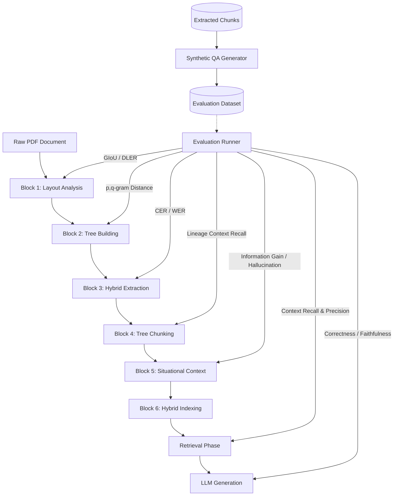

# RAG Pipeline Multi-Block Evaluation Framework Plan (v2 - Enterprise-Grade)

This plan details the design and implementation of a thorough, modular **Evaluation System** designed to benchmark, audit, and measure the performance of each individual block in our 6-block RAG pipeline as well as the final retrieval and generation phases. It incorporates advanced industry-standard techniques to elevate the system to an enterprise-grade evaluation framework.

---

## User Review Required

We have incorporated your valuable feedback to make the evaluation system robust, scalable, and fully automated. Please review the updated highlights:
> [!IMPORTANT]
> **1. Bootstrapping with Automated QA Generation**: We will implement a synthetic QA generator (`generator.py`) that reads our extracted JSON chunks, passes them to an LLM (Ollama/Groq), and automatically synthesizes high-quality queries, expected answers, and target chunk IDs. This eliminates manual labeling bottlenecks.
> **2. Advanced Block 1 (GIoU/DLER) & Block 2 (p,q-gram) Metrics**:
>    - We will swap standard IoU with **Generalized IoU (GIoU)** to gracefully handle empty overlaps and layout alignment penalties.
>    - We will implement **p,q-gram distance** for tree structures, reducing complexity from O(n³) to O(n log n).
> **3. Modern RAG Context Metrics**: We will prioritize **Context Recall** and **Context Precision** over standard hit rates, reflecting recent research on RAG downstream reasoning capabilities.

---

## Evaluation Architecture Overview

The revised system evaluates the pipeline at every level and includes an automated dataset bootstrapping generator:


---

## Block-by-Block Evaluation Metrics (Refined)

### Block 1: Layout Analysis (Docling-Layout-Heron-101 / pdfplumber)
*   **Input**: Raw PDF File Path.
*   **Output**: List of Region Objects `{bbox, type, confidence, page}`.
*   **Metrics**:
    *   **Generalized Intersection-over-Union (GIoU)**: Solves the limitation of standard IoU where non-overlapping bounding boxes yield a zero score, preventing alignment penalty. GIoU computes a bounding box hull and punishes disjoint layout distance.
    *   **Document Layout Error Rate (DLER)**: A holistic layout metric calculating alignment edits (Insert, Delete, Shift, and Merge operations on blocks) required to match the ground truth.

### Block 2: Hierarchical Tree Building
*   **Input**: List of detected regions.
*   **Output**: Hierarchical Tree of Regions (Parent-Child).
*   **Metrics**:
    *   **p,q-gram Distance**: Replaces O(n³) Tree Edit Distance (TED). It splits trees into small substructures (grams of path size $p$ and sibling size $q$) and calculates the symmetric difference between set profiles in highly scalable O(n log n) complexity.
    *   **Edge Precision & Recall**: Precision and recall of parent-child node connections.

### Block 3: Recursive Hybrid Extraction
*   **Input**: Hierarchical Tree of Regions.
*   **Output**: Nested JSON content (Tree Structure).
*   **Metrics**:
    *   **Character Error Rate (CER) & Word Error Rate (WER)**: Text extraction accuracy comparing extracted node text vs ground-truth text.
    *   **Table Grid Integrity**: Col/Row structural match score (exact match rate of parsed headers and table grid dimensions).

### Block 4: Tree Aware Chunking
*   **Input**: Nested JSON.
*   **Output**: List of Chunk Objects with lineage labels.
*   **Metrics**:
    *   **Lineage Context Recall**: Checks if the required structural context (e.g., table header, section titles, document metadata) is correctly present/appended in each child chunk.
    *   **Chunk Boundary Cohesion**: Average semantic variance across split boundaries (ensures clean splits).

### Block 5: Situational Context (Ollama Llama 3.2 3B)
*   **Input**: Chunks + Document Header + Filename.
*   **Output**: Context-aware augmented chunks.
*   **Metrics**:
    *   **Information Gain / Relevance**: LLM-as-a-judge score (1-5) evaluating how well the generated situational context captures the document's true nature.
    *   **Hallucination Rate**: Count/percentage of external facts or keys introduced in the header that do not exist in the source document.

### Block 6: Hybrid Indexing & Retrieval
*   **Input**: Chunks, Search Queries.
*   **Output**: Retrieved Top-K context blocks.
*   **Metrics**:
    *   **Context Recall**: The proportion of ground-truth target context chunks that were successfully retrieved in the top-k results.
    *   **Context Precision**: Measures the ratio of relevant chunks to total retrieved chunks in the context window (ensuring minimum noise).

### End-to-End RAG (Retrieval + Generation)
*   **Input**: User Query.
*   **Output**: Generated Answer.
*   **Metrics**:
    *   **Exact Match (EM) for key figures**: Checks if target numerical values (e.g. invoice numbers, due dates, total balances) are perfectly matched.
    *   **Faithfulness (Groundedness)**: Assesses whether the generated answer is strictly supported by the retrieved context.
    *   **Answer Relevance**: Measures how well the generated answer directly addresses the user's question.

---

## Proposed Changes

We will introduce a dedicated `src/evaluation` package and a command-line runner script to orchestrate the entire evaluation suite.

### 1. [NEW] [generator.py](file:///c:/Users/Abhishek%20Tripathi/Desktop/Extractor/Rag_Bot/src/evaluation/generator.py)
This utility will generate synthetic test cases. It loads the JSON or text extracted chunks, picks high-information chunks, and prompts the LLM (Ollama `llama3.2:3b` or Groq) to generate:
- **Questions**: Factual (e.g. "What is the invoice number?"), comparative (e.g., "Compare the balance of X and Y"), or summary-based.
- **Expected Answer**: The exact target value or response.
- **Lineage/Context**: Target chunk IDs and page numbers.

### 2. [NEW] [evaluation_dataset.json](file:///c:/Users/Abhishek%20Tripathi/Desktop/Extractor/Rag_Bot/src/evaluation/evaluation_dataset.json)
Unified JSON file holding ground-truth records (now generated automatically and manually augmentable):
```json
{
  "test_cases": [
    {
      "doc_id": "eval_invoice_01",
      "file_path": "pdf-rag/test/files/demo-invoice-no-tax-1.pdf",
      "ground_truth": {
        "layout_regions": [
          {"bbox": [36.0, 100.0, 550.0, 180.0], "type": "header_block"},
          {"bbox": [36.0, 200.0, 550.0, 450.0], "type": "table"}
        ],
        "hierarchy": {
          "nodes": ["root", "header_block", "table"],
          "edges": [["root", "header_block"], ["root", "table"]]
        },
        "extracted_text": [
          {"node": "header_block", "text": "ACME Inc. Billing Address..."}
        ],
        "lineage_context": {
          "table": ["Invoice Details", "ACME Inc"]
        },
        "situational_context": "This invoice contains details for a single order from ACME Inc to themselves.",
        "queries": [
          {
            "query": "what is the Invoice Number for document demo-invoice-no-tax-1.pdf",
            "target_chunk_id_pattern": "inside table",
            "expected_answer": "204869"
          }
        ]
      }
    }
  ]
}
```

### 3. [NEW] [metrics.py](file:///c:/Users/Abhishek%20Tripathi/Desktop/Extractor/Rag_Bot/src/evaluation/metrics.py)
Implements advanced comparison metrics:
- `calculate_giou(box1, box2)`
- `calculate_dler(pred_layout, gt_layout)`
- `calculate_pq_gram_distance(tree1, tree2)`
- `evaluate_context_recall(retrieved_chunks, target_chunks)`
- `evaluate_context_precision(retrieved_chunks, target_chunks)`
- `evaluate_llm_metrics(query, context, answer, ground_truth)`

### 4. [NEW] [eval_runner.py](file:///c:/Users/Abhishek%20Tripathi/Desktop/Extractor/Rag_Bot/src/evaluation/eval_runner.py)
The CLI script to run the evaluation pipeline:
- Supports running evaluations for specific blocks (e.g. `--block retrieval` or `--block layout`).
- Generates a beautifully formatted terminal summary and exports a comprehensive evaluation report in Markdown (`evaluation_report.md`).

---

## Verification Plan

### Automated Generation & Execution
1. Run the synthetic generator to bootstrap the evaluation dataset:
   ```bash
   python src/evaluation/generator.py --source_dir uploads/ --output src/evaluation/evaluation_dataset.json
   ```
2. Run the evaluation runner:
   ```bash
   python src/evaluation/eval_runner.py --dataset src/evaluation/evaluation_dataset.json --output evaluation_report.md
   ```

### Manual Verification
1. We will verify that `generator.py` correctly bootstraps and generates high-quality QA pairs from the PDF layout extracts.
2. We will review `evaluation_report.md` to analyze the new GIoU and p,q-gram distance distributions.
3. We will check the **Context Recall** metric specifically to fix the retrieval failure for the ACME invoice number!
